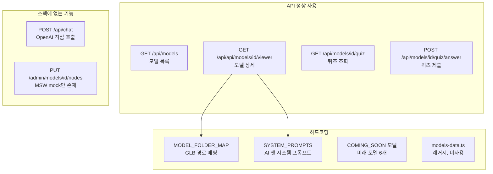

# API 사용 현황 분석 결과

## OpenAPI 스펙 엔드포인트 4개 요약

| 엔드포인트                          | 메서드 | 목적                               |
| ----------------------------------- | ------ | ---------------------------------- |
| `/api/models`                       | GET    | 모델 목록 조회 (페이지네이션)      |
| `/api/api/models/{id}/viewer`       | GET    | 모델 상세 정보 (parts, nodes) 조회 |
| `/api/models/{modelId}/quiz/`       | GET    | 랜덤 퀴즈 조회                     |
| `/api/models/{modelId}/quiz/answer` | POST   | 퀴즈 답안 제출 및 채점             |

---

## 1. GET `/api/models` -- API 정상 사용

- **프론트엔드**: [lib/api.ts](lib/api.ts) `fetchModels()` / `fetchModelsPage()` 함수가 `/api/models`를 호출
- **Next.js 프록시**: [app/api/models/route.ts](app/api/models/route.ts) -> 백엔드 `${API_BASE_URL}/api/models`로 프록시
- **사용처**:
  - [app/page.tsx](app/page.tsx): 홈 페이지에서 `fetchModels()` 호출하여 모델 카드 렌더링
  - [app/study/page.tsx](app/study/page.tsx): 스터디 목록에서 `fetchModelsPage()` 호출, 무한스크롤 페이지네이션 구현
- **판정: API 사용 (정상)**

## 2. GET `/api/api/models/{id}/viewer` -- API 사용 + 하드코딩 보조

- **프론트엔드**: [lib/api.ts](lib/api.ts) `fetchViewerData()` 함수가 `/api/models/${modelId}/viewer`를 호출
- **Next.js 프록시**: [app/api/models/[id]/viewer/route.ts](app/api/models/[id]/viewer/route.ts) -> 백엔드 `${API_BASE_URL}/api/api/models/${modelId}/viewer`로 프록시
- **사용처**: [app/study/[modelId]/page.tsx](app/study/[modelId]/page.tsx) `useEffect` 내에서 `fetchViewerData(modelId)` 호출
- **하드코딩 부분**:
  - `MODEL_FOLDER_MAP` ([app/api/models/[id]/viewer/route.ts](app/api/models/[id]/viewer/route.ts) 5-13행): 모델 ID를 GLB 폴더명으로 매핑하는 하드코딩된 맵. 백엔드에서 내려주는 `glbUrl`을 로컬 `/models/` 경로로 변환할 때 사용
  - `STRIP_SUFFIX_FILES` (15행): 파일명 정규화를 위한 하드코딩 목록
  - `systemPrompt` ([lib/constants/system-prompts.ts](lib/constants/system-prompts.ts)): 모델별 AI 시스템 프롬프트가 7개 모델 전부 하드코딩. API 스펙의 `ModelInfoDto`에 `theory` 필드가 있지만, 시스템 프롬프트는 API에서 제공하지 않으므로 불가피한 하드코딩
- **판정: API 사용 (보조적 하드코딩 존재)**

## 3. GET `/api/models/{modelId}/quiz/` -- API 정상 사용

- **프론트엔드**: [lib/api.ts](lib/api.ts) `fetchQuiz()` 함수가 `/api/models/${modelId}/quiz`를 호출 (count, excludedIds 쿼리 파라미터 지원)
- **Next.js 프록시**: [app/api/models/[id]/quiz/route.ts](app/api/models/[id]/quiz/route.ts) -> 백엔드로 프록시
- **사용처**: [hooks/use-quiz.ts](hooks/use-quiz.ts) `startQuiz()` 내에서 `fetchQuiz(modelId, { count: 3 })` 호출 -> [components/viewer/panels/quiz-panel.tsx](components/viewer/panels/quiz-panel.tsx)에서 사용
- **판정: API 사용 (정상)**

## 4. POST `/api/models/{modelId}/quiz/answer` -- API 정상 사용

- **프론트엔드**: [lib/api.ts](lib/api.ts) `submitQuizAnswers()` 함수가 `/api/models/${modelId}/quiz/answer`를 POST 호출
- **Next.js 프록시**: [app/api/models/[id]/quiz/answer/route.ts](app/api/models/[id]/quiz/answer/route.ts) -> 백엔드로 프록시
- **사용처**: [hooks/use-quiz.ts](hooks/use-quiz.ts) `handleSubmit()` 내에서 `submitQuizAnswers(modelId, answerList)` 호출 -> 결과를 [components/viewer/panels/quiz-result-card.tsx](components/viewer/panels/quiz-result-card.tsx)에서 렌더링
- **판정: API 사용 (정상)**

---

## API 밖의 하드코딩 발견사항

### (A) 레거시 하드코딩 파일 (미사용)

- [lib/models-data.ts](lib/models-data.ts): 7개 모델의 전체 데이터(parts, instances, systemPrompt 등)가 약 800행에 걸쳐 하드코딩
- 현재 어디에서도 import하지 않음 -- **완전 미사용 레거시 코드**
- `getModelById()` 함수도 정의만 되어있고 호출되지 않음

### (B) "Coming Soon" 모델 (의도적 하드코딩)

- [lib/constants/coming-soon-models.ts](lib/constants/coming-soon-models.ts): 6개 미래 모델 (생명공학 3개, 의공학 3개) 하드코딩
- [app/study/[modelId]/page.tsx](app/study/[modelId]/page.tsx) 21-28행: `COMING_SOON_IDS` 매핑 하드코딩
- 아직 백엔드에 존재하지 않는 모델이므로 의도적인 하드코딩

### (C) AI 챗 기능 (OpenAPI 스펙에 없는 기능)

- [app/api/chat/route.ts](app/api/chat/route.ts): OpenAI GPT-4o-mini를 직접 호출하는 AI 챗 엔드포인트
- 백엔드 API에 챗 엔드포인트가 없으므로 프론트엔드에서 자체 구현
- 시스템 프롬프트는 [lib/constants/system-prompts.ts](lib/constants/system-prompts.ts)에서 하드코딩
- MSW 핸들러에 mock도 있지만 프로덕션에서는 실제 OpenAI API 호출

### (D) 노드 저장 기능 (OpenAPI 스펙에 없는 기능)

- [lib/api.ts](lib/api.ts) `saveNodes()`: `PUT /admin/models/${modelId}/nodes`로 호출
- 백엔드 OpenAPI 스펙에 정의되어 있지 않음
- MSW mock 핸들러에만 존재 ([mocks/handlers.ts](mocks/handlers.ts) 129-152행)

### (E) 타입 시스템 이중화

- `@/lib/types` (구 타입): 프론트엔드 내부용 `Model`, `ModelPart` 등
- `@/types/model` (신 타입): API 응답 스키마에 맞춘 `ModelData`, `Part`, `Node` 등
- [lib/transform.ts](lib/transform.ts)의 `toViewerModel()` 함수가 API 응답(신) -> 내부 모델(구)로 변환
- 두 타입 시스템이 공존하며, API 데이터를 항상 구 타입으로 변환하여 사용

---

## 최종 요약

- **4개 OpenAPI 엔드포인트 모두 API를 통해 정상 사용 중**
- 하드코딩은 주로 보조적 역할 (GLB 경로 변환, 시스템 프롬프트, Coming Soon 모델)
- `lib/models-data.ts`는 레거시 파일로 삭제 가능
- AI 챗과 노드 저장은 백엔드 스펙에 없는 프론트엔드 자체 기능
