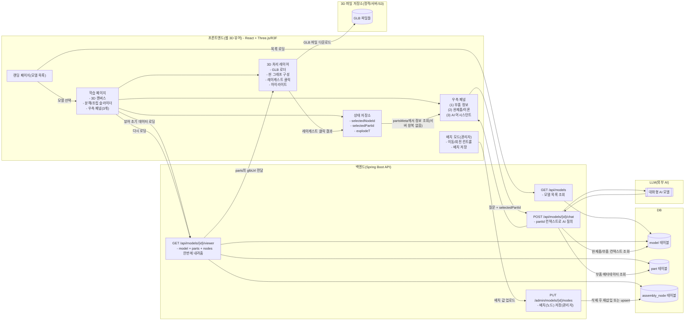

```mermaid
flowchart LR
 subgraph FE["프론트엔드(웹 3D 뷰어) - React + Three.js/R3F"]
        FE1["랜딩 페이지(모델 목록)"]
        FE2["학습 페이지
    - 3D 캔버스
    - 분해/조립 슬라이더
    - 우측 패널(3개)"]
        FE3["3D 처리 레이어
    - GLB 로더
    - 씬 그래프 구성
    - 레이캐스트 클릭
    - 하이라이트"]
        FE4["상태 저장소
    - selectedNodeId
    - selectedPartId
    - explodeT"]
        FE5["우측 패널
    (1) 부품 정보
    (2) 완제품/이론
    (3) AI 어시스턴트"]
        FE6["배치 모드(관리자)
    - 이동/회전 컨트롤
    - 배치 저장"]
  end
 subgraph BE["백엔드(Spring Boot API)"]
        BE1["GET /api/models
    - 모델 목록 조회"]
        BE2["GET /api/models/{id}/viewer
    - model + parts + nodes 한번에 내려줌"]
        BE3["POST /api/models/{id}/chat
    - partId 컨텍스트로 AI 질의"]
        BE4["PUT /admin/models/{id}/nodes
    - 배치(노드) 저장(관리자)"]
  end
 subgraph DB["DB"]
        DB1[("model 테이블")]
        DB2[("part 테이블")]
        DB3[("assembly_node 테이블")]
  end
 subgraph ST["3D 파일 저장소(정적/서버/S3)"]
        ST1[("GLB 파일들")]
  end
 subgraph AI["LLM(외부 AI)"]
        AI1[["대화형 AI 모델"]]
  end
    FE1 -- 모델 선택 --> FE2
    FE2 --> FE3 & FE4 & FE5
    FE1 -- 목록 로딩 --> BE1
    FE2 -- 뷰어 초기 데이터 로딩 --> BE2
    BE1 --> DB1
    BE2 --> DB1 & DB2 & DB3
    BE2 -- parts의 glbUrl 전달 --> FE3
    FE3 -- GLB 파일 다운로드 --> ST1
    FE3 -- 레이캐스트 클릭 결과 --> FE4
    FE4 -- partsMeta에서 정보 조회(서버 왕복 없음) --> FE5
    FE5 -- 질문 + selectedPartId --> BE3
    BE3 -- 완제품/부품 컨텍스트 조회 --> DB1
    BE3 -- 부품 메타데이터 조회 --> DB2
    BE3 --> AI1 & FE5
    AI1 --> BE3
    FE6 -- 배치 값 업로드 --> BE4
    BE4 -- 삭제 후 재삽입 또는 upsert --> DB3
    FE2 -- 다시 로딩 --> BE2
```
