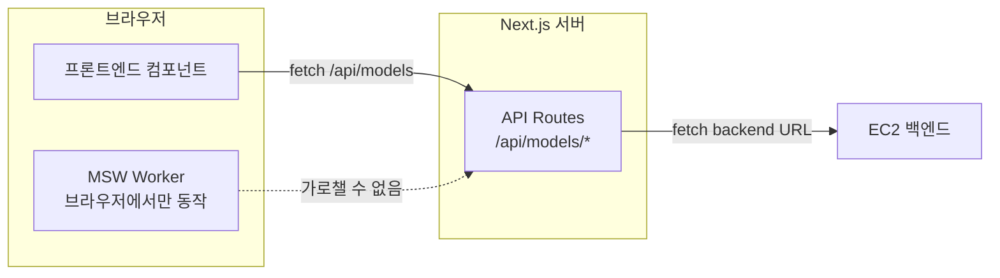
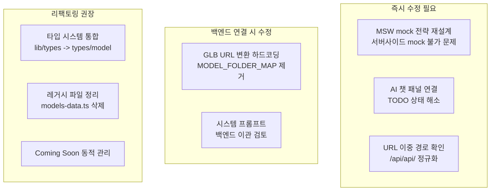

# 백엔드 연동 준비 상태 분석 및 수정 필요사항

---

## Part 1: MSW Mock 현황 -- 엔드포인트별 준비 상태

### 핵심 아키텍처 문제

현재 MSW는 **브라우저(클라이언트)** 에서만 동작합니다 ([mocks/browser.ts](mocks/browser.ts) `setupWorker`). 그런데 4개 OpenAPI 엔드포인트는 모두 **Next.js API Routes(서버사이드)** 를 통해 백엔드를 호출합니다. 따라서 **MSW가 이 4개 엔드포인트를 가로챌 수 없습니다.**



즉, `mocks/model/*.json`에 mock 데이터가 존재하지만, 현재 이 데이터를 서빙하는 핸들러가 없어서 **사실상 사용되지 않습니다.**

---

### 엔드포인트별 상세 현황

#### 1. GET `/api/models` (모델 목록)

- **MSW 핸들러**: 없음
- **Mock 데이터**: 없음 (ModelSliceDto 형태의 목록 mock 없음)
- **현재 동작**: Next.js API Route가 EC2 백엔드를 직접 호출
- **백엔드 없으면**: 500 에러 발생 -> 홈/스터디 목록 페이지 빈 화면

#### 2. GET `/api/api/models/{id}/viewer` (모델 상세)

- **MSW 핸들러**: 없음 (handlers.ts 주석: "실제 백엔드 API를 사용하므로 MSW에서 제외함")
- **Mock 데이터**: 존재 (`mocks/model/*.json` 7개 파일) -- 그러나 핸들러가 없어 **서빙 불가**
- **현재 동작**: Next.js API Route가 EC2 백엔드를 직접 호출
- **백엔드 없으면**: 500 에러 -> 3D 뷰어 페이지 로딩 실패, `notFound()` 호출

#### 3. GET `/api/models/{modelId}/quiz/` (퀴즈 조회)

- **MSW 핸들러**: 없음
- **Mock 데이터**: 없음 (퀴즈 데이터 자체가 프로젝트 내에 없음)
- **현재 동작**: Next.js API Route가 EC2 백엔드를 직접 호출
- **백엔드 없으면**: 500 에러 -> "퀴즈를 불러오는 데 실패했습니다" 에러 메시지

#### 4. POST `/api/models/{modelId}/quiz/answer` (퀴즈 제출)

- **MSW 핸들러**: 없음
- **Mock 데이터**: 없음
- **현재 동작**: Next.js API Route가 EC2 백엔드를 직접 호출
- **백엔드 없으면**: 500 에러 -> "답안 제출에 실패했습니다" 에러 메시지

#### 5. POST `/api/models/:id/chat` (AI 챗) -- OpenAPI 스펙에 없음

- **MSW 핸들러**: 존재 -- **그러나 실제로 연결되지 않음**
- 핸들러는 `/api/models/:id/chat`을 mock하지만, AI 챗 패널([components/viewer/panels/ai-chat-panel.tsx](components/viewer/panels/ai-chat-panel.tsx))의 `handleSubmit`은 **TODO 상태**로 아무 API도 호출하지 않음
- `lib/api.ts`의 `sendChatMessage()` 함수도 정의만 되어 있고 **어디서도 import하지 않음**
- `/api/chat` Next.js route(OpenAI GPT-4o-mini)도 존재하지만 프론트에서 호출하지 않음

#### 6. PUT `/admin/models/:id/nodes` (노드 저장) -- OpenAPI 스펙에 없음

- **MSW 핸들러**: 존재하고 정상 동작
- Edit Panel에서 사용

---

### MSW Mock 준비 현황 요약

| 엔드포인트                          | MSW 핸들러    | Mock 데이터        | 실제 연결         |
| ----------------------------------- | ------------- | ------------------ | ----------------- |
| GET `/api/models`                   | 없음          | 없음               | 서버사이드 프록시 |
| GET `/api/api/models/{id}/viewer`   | 없음          | JSON 있으나 미서빙 | 서버사이드 프록시 |
| GET `/api/models/{id}/quiz/`        | 없음          | 없음               | 서버사이드 프록시 |
| POST `/api/models/{id}/quiz/answer` | 없음          | 없음               | 서버사이드 프록시 |
| POST `/api/models/:id/chat`         | 있으나 미연결 | 고정 응답          | AI챗 패널 TODO    |
| PUT `/admin/models/:id/nodes`       | 있고 정상     | 성공 응답          | 정상 동작         |

---

## Part 2: 추후 백엔드 연결 시 수정 필요사항

### 수정사항 A: URL 경로 이중화 문제 (중요도: 높음)

[app/api/models/[id]/viewer/route.ts](app/api/models/[id]/viewer/route.ts) 57행:

```typescript
const response = await fetch(`${API_BASE_URL}/api/api/models/${modelId}/viewer`);
```

`/api/api/` 이중 경로는 OpenAPI 스펙에서도 `/api/api/models/{id}/viewer`로 정의되어 있어 의도적인 것으로 보이지만, 백엔드 팀과 확인 필요. 만약 백엔드에서 경로를 `/api/models/{id}/viewer`로 정규화하면 이 부분 수정 필요.

### 수정사항 B: GLB URL 변환 하드코딩 (중요도: 높음)

[app/api/models/[id]/viewer/route.ts](app/api/models/[id]/viewer/route.ts) 5-47행:

```typescript
const MODEL_FOLDER_MAP: Record<string, string> = {
  v4_engine: "V4_Engine",
  suspension: "Suspension",
  // ...7개 하드코딩
};
```

- 새 모델이 추가될 때마다 이 맵을 수동으로 업데이트해야 함
- 백엔드가 올바른 GLB URL(절대 경로 또는 CDN URL)을 반환하면 `convertGlbUrl()` 로직 전체 삭제 가능
- **권장**: 백엔드에서 완전한 GLB URL을 내려주도록 협의

### 수정사항 C: AI 챗 기능 미구현 (중요도: 높음)

현재 상태:

- [components/viewer/panels/ai-chat-panel.tsx](components/viewer/panels/ai-chat-panel.tsx) 25-28행: `handleSubmit`이 TODO 상태
- [app/api/chat/route.ts](app/api/chat/route.ts): OpenAI GPT-4o-mini 호출 코드 존재하지만 프론트에서 연결 안 됨
- [lib/api.ts](lib/api.ts) `sendChatMessage()`: 정의만 되어 있고 미사용
- `.env.local`에 `OPENAI_API_KEY` 없음

수정 필요:

- AI 챗 패널에서 `/api/chat` 또는 `sendChatMessage()` 연결
- 또는 백엔드에 챗 API가 추가되면 해당 엔드포인트로 연결

### 수정사항 D: 시스템 프롬프트 하드코딩 (중요도: 중간)

[lib/constants/system-prompts.ts](lib/constants/system-prompts.ts): 7개 모델의 시스템 프롬프트가 하드코딩.

- API 스펙의 `ModelInfoDto`에 `theory` 필드가 있고, mock JSON에도 `theory` 데이터가 있음
- 하지만 `theory`와 `systemPrompt`는 다른 목적 (theory = 학습 이론 설명, systemPrompt = AI에게 주는 역할 지시)
- **권장**: 백엔드에 시스템 프롬프트 필드 추가 요청하거나, `theory` 기반으로 동적 생성

### 수정사항 E: Coming Soon 모델 ID 하드코딩 (중요도: 낮음)

두 곳에 하드코딩:

- [lib/constants/coming-soon-models.ts](lib/constants/coming-soon-models.ts): 6개 미래 모델 목록
- [app/study/[modelId]/page.tsx](app/study/[modelId]/page.tsx) 21-28행: `COMING_SOON_IDS` 매핑

새 모델 추가/제거 시 수동 관리 필요. 백엔드에서 모델 상태(available/coming_soon)를 관리하면 삭제 가능.

### 수정사항 F: 타입 시스템 이중화 (중요도: 중간)

- `@/lib/types`: 프론트엔드 내부용 (Model, ModelPart, PartInstance 등) -- 17개 파일에서 사용
- `@/types/model`: API 스키마 기반 (ModelData, Part, Node 등) -- 12개 파일에서 사용
- [lib/transform.ts](lib/transform.ts)의 `toViewerModel()`이 매번 변환 수행

**권장**: API 타입으로 통합하여 변환 레이어 제거. 모든 컴포넌트가 `@/types/model`의 타입을 직접 사용하도록 리팩토링.

### 수정사항 G: 레거시 파일 정리 (중요도: 낮음)

- [lib/models-data.ts](lib/models-data.ts): ~800행의 하드코딩 데이터, **완전 미사용**. 삭제 권장.
- `lib/api.ts`의 `sendChatMessage()`: 미사용 함수. 삭제 또는 AI 챗 연동 시 활용.

### 수정사항 H: MSW mock 전략 재설계 (중요도: 높음)

현재 MSW가 클라이언트 전용(`setupWorker`)이라 서버사이드 API 라우트를 mock할 수 없음.

**옵션 1 -- Next.js API Route 내 fallback mock** (권장):

- API Route에서 `NEXT_PUBLIC_API_BASE_URL`이 비어있거나 백엔드 연결 실패 시 로컬 JSON 반환
- 이미 `mocks/model/*.json`에 모델 데이터 존재하므로 활용 가능

**옵션 2 -- MSW Node.js 서버 추가** (`setupServer`):

- `msw/node`를 사용하여 서버사이드에서도 mock 인터셉트
- 설정이 복잡하지만 가장 깔끔한 분리

**옵션 3 -- 프록시 제거, 클라이언트 직접 호출**:

- Next.js API Route 프록시 대신 클라이언트에서 백엔드 직접 호출
- 기존 브라우저 MSW가 정상 동작
- 단, CORS 설정 필요

---

## 전체 요약



- **MSW mock이 제대로 준비된 엔드포인트**: PUT `/admin/models/:id/nodes` (1개뿐)
- **MSW mock이 없는 엔드포인트**: GET `/api/models`, GET viewer, GET quiz, POST quiz/answer (4개 전부)
- **MSW mock이 있으나 미연결**: POST `/api/models/:id/chat` (AI 챗 TODO)
- **근본 문제**: 서버사이드 프록시 구조에서 클라이언트 MSW는 효과 없음
